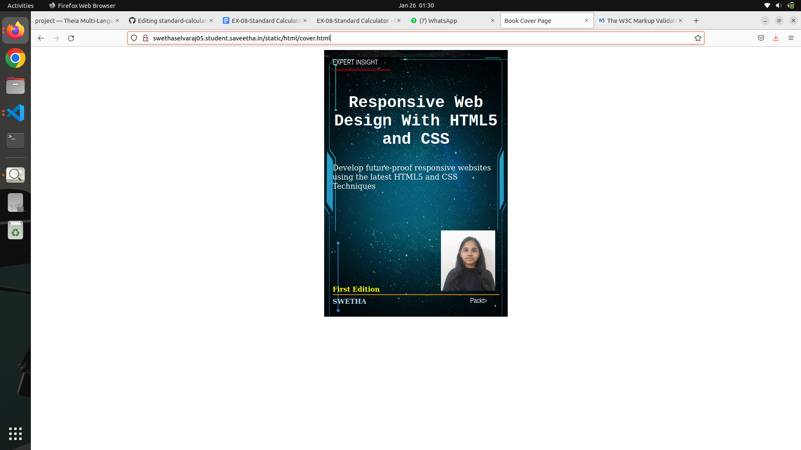
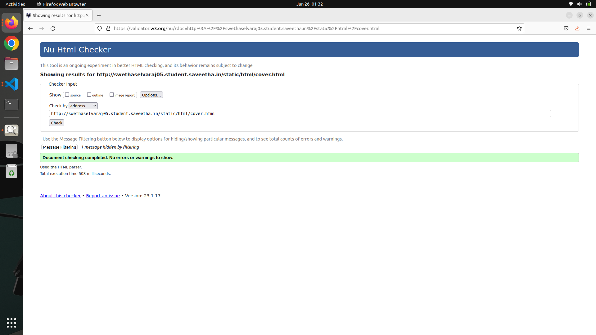

# Ex-06-Book-Cover-Design
## AIM:
To develop a website to display the cover page design of a book

## Design Steps:

### Step 1:
Clone the GitHub repsoitory and create a Django admin interface.

### Step 2:
Write HTML and CSS Code for designing book cover page and execute them.

## Code:
```

<!DOCTYPE html>
<html lang="en">
    <head>
         <meta name="viewport" 
         content="width=device-width, initial-scale=1.0">
         <style>

        .bookpage{
            width: 400px;
            height: 600px;
            background-color: #3d3a3a;
            color:white;
            margin-left: auto;
            margin-right: auto;
            padding: 20px;
            font-family: 'Franklin Gothic Medium', 'Arial Narrow', Arial, sans-serif;
            background-image: url(/static/images/temp.jpe
            g);
            background-size: cover;
        }
            

        .toptext{
            color:white;

        }

        
        .tophr{
            width:140px;
        }
        .author{
            color: white;
            display: inline;
            position: relative;
            color:lightblue;
            top:169px;
            
            font-family:Georgia;
            font-size: medium;
        }
        .booktitle{
            font-family: 'Courier New', Courier, monospace;
            font-size: larger;
            text-align: center;
            position: relative;
            top: 30px;
        
        }
        .id {
            width:400px;
            position: relative;
            top:180px;
            
        }
        .publisher{
            font-size: medium;
            position: relative;
            top:132px;
            left:330px;
        }
        .edition{
            color:yellow;
            font-size: medium;
            font-family: Verdana;
            position:relative;
            top:85px;

        }
        .subtitle{
            font-family:Tahoma;
            font-size: large;
            position: relative;
            top:40px;
        }
        .photo{
            position: relative;
            top: 135px;
            left: 260px;
            width: 100px;
            height: 100px;
            background-size: cover;
        }
        </style>
        <title>Book Cover Page</title>
    </head>
    <body>
        <div class="bookpage">
            <div class="toptext">
                EXPERT INSIGHT
            </div>
            <div class="tophr">
                <hr style="color: red;">
            </div>
            <div class="booktitle">
                <h1>Responsive Web Design With HTML5 and CSS</h1></div>
            <div class="subtitle">
                Develop future-proof responsive websites using the latest HTML5 and CSS Techniques
            </div>
            <div class="photo">
                
            </div>
            <div class="id">
                <hr style="color: orange;">
            </div>
            <div class="author">
               <p><b>SWETHA</b></p>
            </div>
            <div class="publisher">
                Packt>
            </div>
            <div class="edition">
                <b>First Edition</b>
            </div>
            
        </div>
    </body>
</html>

```

## OUTPUT:


## HTML VALIDATOR:


## Result:
The program for designing book cover page using HTML and CSS is executed succesfully
